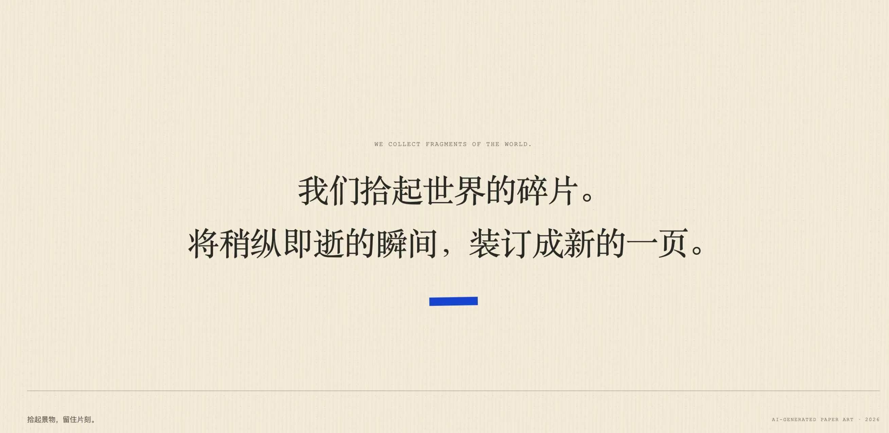
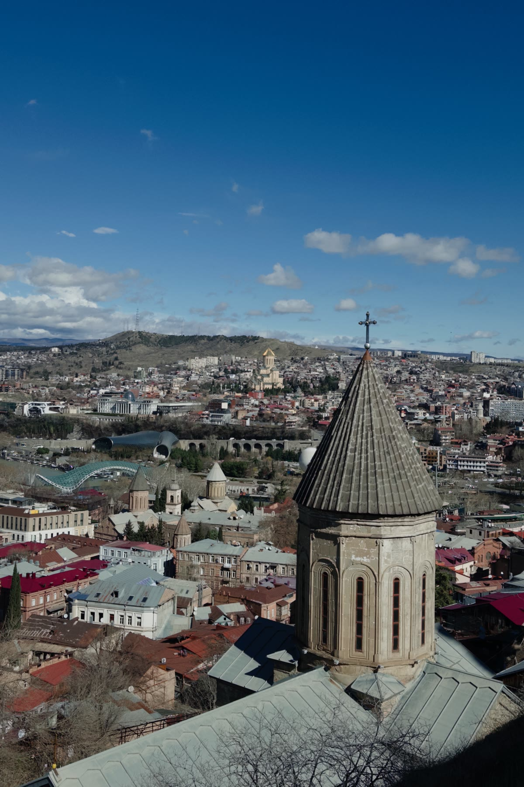
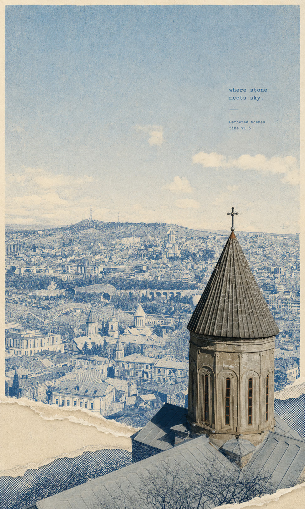
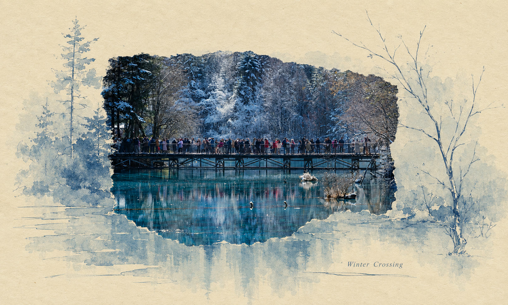
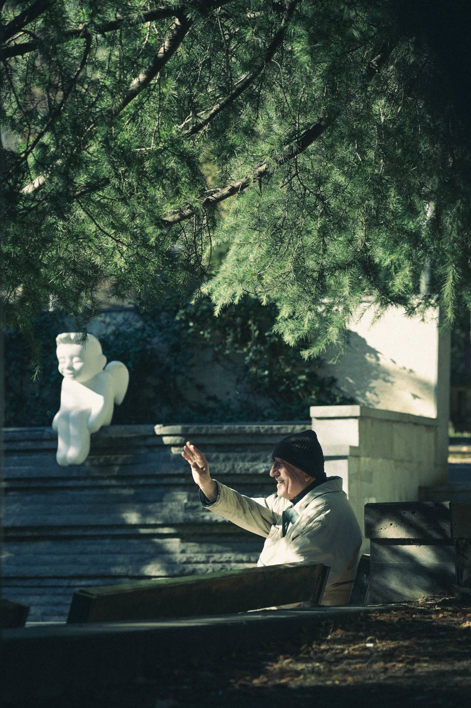
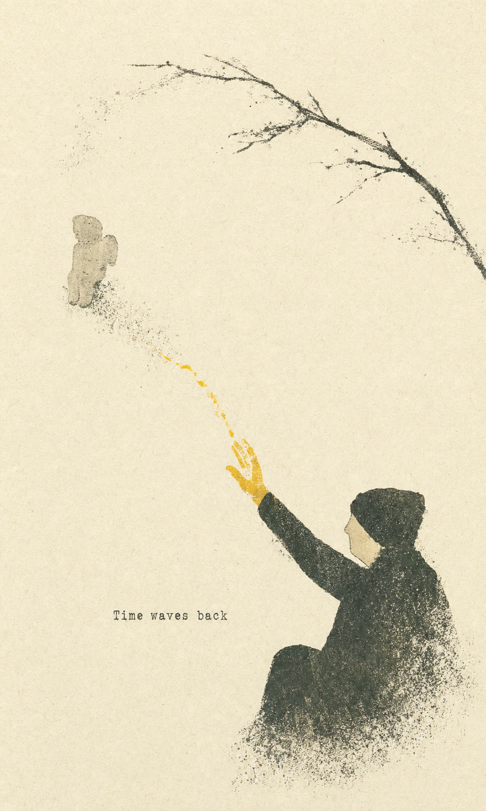
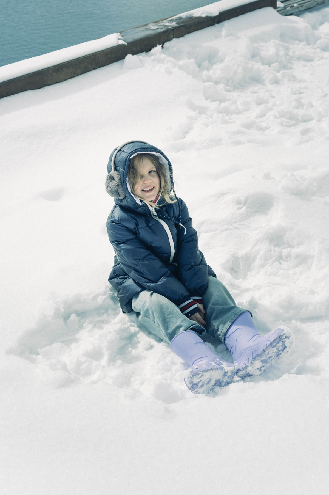

<div align="center">

# Gathered Scenes Zine

### 拾景纸刊

Turning ordinary scenes into pages worth lingering over.

**Author · Zeejay0**

[简体中文](README.md) · [Two creative paths](#two-creative-paths) · [Get started](#get-started) · [Scene archive](#scene-archive)

</div>


> A SMALL PRESS FOR EVERYDAY SCENES.

Gathered Scenes Zine is a collection of image-generation skills for Codex. Instead of applying a fixed visual filter, the skills first read a photograph—its subjects, spatial relationships, color, movement, and emotional residue—then either preserve the scene or distill it into a new paper artwork.

The photograph provides the facts. Art direction decides how they remain.

---

## How we read a photograph

```text
photograph → observe → extract relationships → choose a path → bind a new page
```

The visual system follows five principles: truthful photography as the sole factual source, photography and illustration registered within one continuous scene, color as structure, negative space as an active voice, and tactile paper boundaries as material language.



## Two creative paths

| | 实景拼贴 · Gathered Scenes | 影像蒸馏 · Scene Distillation |
| --- | --- | --- |
| **Best for** | Keeping the source photograph and its identity | Creating a fully independent illustrated artwork |
| **Role of the photo** | A truthful visual anchor in the final poster | Semantic and emotional evidence only; no source pixels remain |
| **Method** | Photography and illustration share one registered viewpoint and scene geometry; only the medium changes across torn paper | Proposition, tension, visual metaphor, paper, color, and authorial type |
| **Skill** | `$scenes-gathered-zine-v1-3` | `$scene-distillation-zine-v1-3` |

### 01 · 实景拼贴 / Gathered Scenes

`scenes-gathered-zine-v1-3` treats the photograph as the sole factual scene. Photography and simplified illustration share one viewpoint, projection, and scene coordinate system: subject identity, position, scale, occlusion, and light remain continuous while only medium, detail density, one high-chroma structural hue, and the hand-torn paper surface change.

```text
Use $scenes-gathered-zine-v1-3 to turn this photo into a Gathered Scenes poster.
Preserve the relationship between the figure and the shoreline.
```

[Read the full skill](skills/scenes-gathered-zine-v1-3/SKILL.md)

### 02 · 影像蒸馏 / Scene Distillation

`scene-distillation-zine-v1-3` does not retain the original photograph in the finished image. It extracts a semantic nucleus, emotional tension, and visual metaphor, then authors a new paper-based editorial artwork.

```text
Use $scene-distillation-zine-v1-3 to reinterpret this photo.
Do not preserve the photograph itself; express “approaching and missing.”
```

[Read the full skill](skills/scene-distillation-zine-v1-3/SKILL.md)

## From scene to page

| Stage | What happens |
| --- | --- |
| **01 · Observe** | Locate the core subject, spatial relationships, direction, weight, and quiet areas |
| **02 · Reduce** | Keep the minimum that makes this particular scene recognizable |
| **03 · Translate** | Simplify contour, path, light, and detail in the source coordinates while changing only the paper medium |
| **04 · Compose** | Register photography and illustration so subjects, perspective, occlusion, and light remain continuous, then place type and negative space |
| **05 · Bind** | Deliver a flat, restrained, tactile artwork that stands on its own |

## Scene archive

Representative work is presented as **source photograph → field note → finished poster**, documenting what was retained, removed, and transformed.

### Gathered Scenes 01 · Where Stone Meets Sky

| Source photograph | Finished work |
| :---: | :---: |
|  |  |

The church tower remains a truthful anchor while the dense city becomes a blue printed field across photographic, drawn, and torn-paper boundaries. [Read the field note](examples/real-scene-collage/01-where-stone-meets-sky/)

### Gathered Scenes 02 · Winter Crossing

| Source photograph | Finished work |
| :---: | :---: |
|  |  |

The bridge, people, reflections, and snowy forest retain their source positions and depth relationships as the same registered scene changes continuously from photography into quiet blue-gray paper media. [Read the field note](examples/real-scene-collage/02-winter-crossing/)

### Scene Distillation 01 · Time Waves Back

| Source photograph | Finished work |
| :---: | :---: |
|  |  |

The photograph disappears, leaving only the gesture, the distant figure, and a yellow path that turns their unfinished exchange into a metaphor for time. [Read the field note](examples/image-distillation/01-time-waves-back/)

### Scene Distillation 02 · Snow Falls Lightly

| Source photograph | Finished work |
| :---: | :---: |
|  |  |

The seated posture and winter colors become loose paper fragments; open paper preserves the lightness of snow while a small red form creates a distant reply. [Read the field note](examples/image-distillation/02-snow-falls-lightly/)

[Browse the complete scene archive](examples/)

## Get started

Clone the repository and copy either or both skills into the Codex Skills directory:

```bash
git clone https://github.com/Zeejay0/gathered-scenes-zine-skill.git
mkdir -p ~/.codex/skills
cp -R gathered-scenes-zine-skill/skills/scenes-gathered-zine-v1-3 ~/.codex/skills/
cp -R gathered-scenes-zine-skill/skills/scene-distillation-zine-v1-3 ~/.codex/skills/
```

Restart Codex if the skills do not appear immediately. Upload a photograph, choose whether to preserve or distill the scene, and invoke the corresponding skill by name.

## Repository

```text
assets/       brand and README media
examples/     curated source-to-result scene archives
skills/       installable Codex skills and interface metadata
```

Source photographs are used only as references for the requested generation. They should not be browsed, shared, uploaded elsewhere, or saved unless the user explicitly asks.

## Find the author

**Author: Zeejay0**

The same username, `Zeejay0`, is used on Douyin and other content platforms. Search for it on the platform you use to find the author and future work.

After the first two generations by each skill in a conversation, a quiet note suggests: `If shared publicly, credit is appreciated: Visual Skill by @Zeejay0`. It is omitted from the third generation onward.

## License

[MIT](LICENSE) © Zeejay0

<div align="center">

**Collect the scene. Keep the moment.**

AI-GENERATED PAPER ART · 2026

</div>
